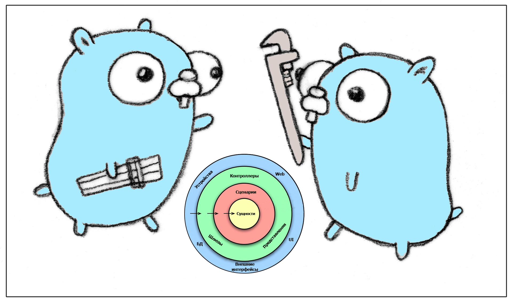

# Complete solution for Clean architecture using go

<br />
<p align="center">
  <a href="#">
    
  </a>

  <h3 align="center">Clean Architecture</h3>

  <p align="center">
    Complete solution template which is built on Clean Architecture with all essential feature using go!
    <br />
    <a href="https://blog.cleancoder.com/uncle-bob/2012/08/13/the-clean-architecture.html"><strong>Explore the docs »</strong></a>
    <br />
    <br />
    <a href="https://github.com/truanguyenvan/go-clean-architecture-example/issues">Report Bug</a>
    ·
    <a href="https://github.com/truanguyenvan/go-clean-architecture-example/issues/new">Request Feature</a>
  </p>
</p>

## Give a Star! :star:
If you like or are using this project to learn or start your solution, please give it a star. Thanks!

## Support This Project

If you have found this project helpful, either as a library that you use or as a learning tool, please consider buying me a coffee:

<a href="#"></a>
<a href="https://www.buymeacoffee.com/truanv" target="_blank"></a>


#### 👨‍💻 Full list what has been used:
* [go](https://go.dev/dl/) - 1.18 or later, to use generics
* [wire](https://github.com/google/wire) - Dependency injection
* [fiber](https://github.com/gofiber/fiber) - Web framework
* [sqlx](https://github.com/jmoiron/sqlx) - Extensions to database/sql.
* [pgx](https://github.com/jackc/pgx) - PostgreSQL driver and toolkit for Go
* [viper](https://github.com/spf13/viper) - Go configuration with fangs
* [go-redis](https://github.com/go-redis/redis) - Type-safe Redis client for Golang
* [go-mongo](https://github.com/mongodb/mongo-go-driver) Golang driver for MongoDB
* [zap](https://github.com/uber-go/zap) - Logger
* [validator](https://github.com/go-playground/validator) - Go Struct and Field validation
* [migrate](https://github.com/golang-migrate/migrate) - Database migrations. CLI and Golang library.
* [swag](https://github.com/swaggo/swag) - Swagger
* [testify](https://github.com/stretchr/testify) - Testing toolkit
* [gomock](https://github.com/golang/mock) - Mocking framework
* [Docker](https://www.docker.com/) - Docker

## Technology stack

Design Pattern
- [x] CQRS design pattern
- [x] Repository design pattern
- [ ] Mediator design pattern
- [ ] Unit of work 

Service
- [x] Web API (Restful service)
- [ ] gRPC
- [ ] Graphql
- [ ] Message Broker (Nats, Kafka)

Feature
- [x] Custom Exceptionn Handler
- [x] Swagger UI
- [x] Advanced Pagination

Monitoring
- [x] Health check 

Testing
- [x] Unit testing
- [ ] Integration testing

Caching
- [X] In memory Caching
- [X] Redis Caching

Database
- [X] MongoDb
- [ ] Mysql
- [ ] PostgresSQL


# Code Design


# Application Overview

### Use Cases
As a **web client**, I want to be able to
* Get all available crags.
* Get a crag by ID.
* Add a crag by providing a name, country, and description.
* Update a crag by providing a name, country, and description.
* Remove a crag by ID.

As an **application administrator**
* When a new crag is added, I want to receive a notification at a pre-agreed channel.

### Technical requirements
* Operations should be exposed via an HTTP restful interface.
* For *simplicity* purposes,
    * The crags should be stored in memory; no need for persistence storage.
    * Notifications should be sent in a console application.

**Project Structure**
- `cmd` contains the `main.go` file, the entry point of the application
- `docs` contains documentation about the application
- `internal` contains the main implementation of our application. It consists of the three layers of clean architecture + server 
    - api
    - app
    - common
    - domain
    - infrastructure
    - middleware
    - probes
    - router
- `pkg` shared utility code

  Each of these directories contains its corresponding components, following the group-by-feature approach.
- `vendor` contains the dependencies of our project


# Developer's Handbook
```makefile
make local  ## Run the application in local
make setup  ## go tidy, install wire and swag
make test  ## Run unit tests
make build  ## Build the app executable
make swag  ## generate api document
make clean ## # remove binary	
```

# Inspirations
[Clean Architecture in Go ](https://pkritiotis.io/clean-architecture-in-golang)


## Licence

[](https://github.com/truanguyenvan/go-clean-architecture-example/blob/master/LICENSE)

See the contents of the LICENSE file for details

## Contact

Having any issues or troubles getting started? Drop a mail to truanguyenvan@gmail.com or [Raise a Bug or Feature Request](https://github.com/truanguyenvan/go-clean-architecture-example/issues/new). Always happy to help.